#Aladdin-Unity-Shader

这个是关于Unity3D Shader的Demo，目前是自己博客专栏《阿拉丁Unity3D Shader编程》中的shader案例的代码搜集。

## 说明
由于代码上传大小限制，这里只展示效果图，具体代码看：https://gitee.com/dingxiaowei/AladdinShader

## 专栏地址

[阿拉丁Shader编程](https://aladdin.blog.csdn.net/article/category/6670402)

## 案例

#### Volume 1 凹凸纹理显示+自选边缘颜色和强度Shader

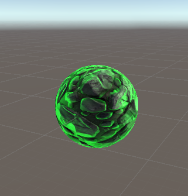

#### Volume 2 波光粼粼的鱼

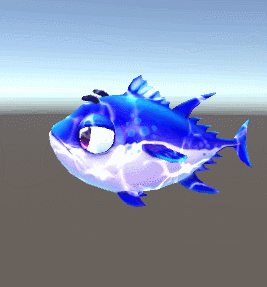

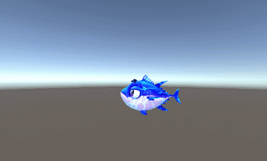

对比效果

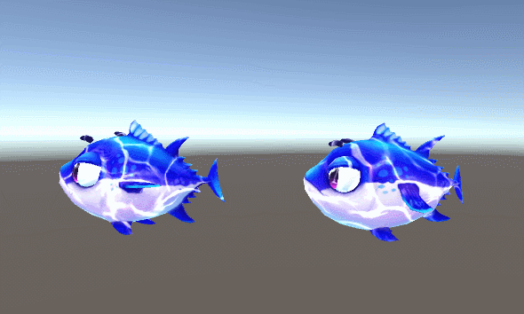

前面的鱼是通过shader实现的动画，后面的鱼是animator动画

#### Volume 3 人物模型常见效果

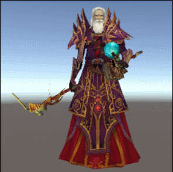

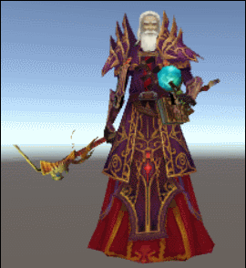

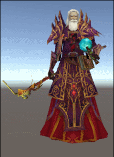

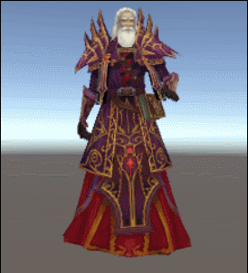

#### Volume 4 常见2D贴图效果

##### 图片灰态
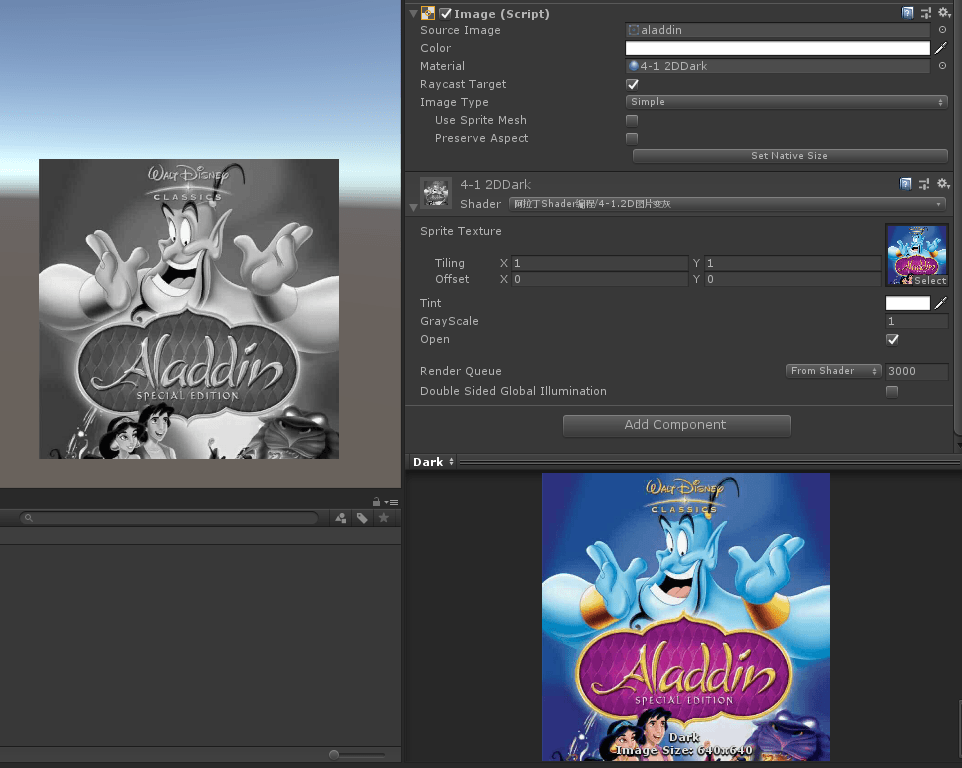

##### 边缘高光
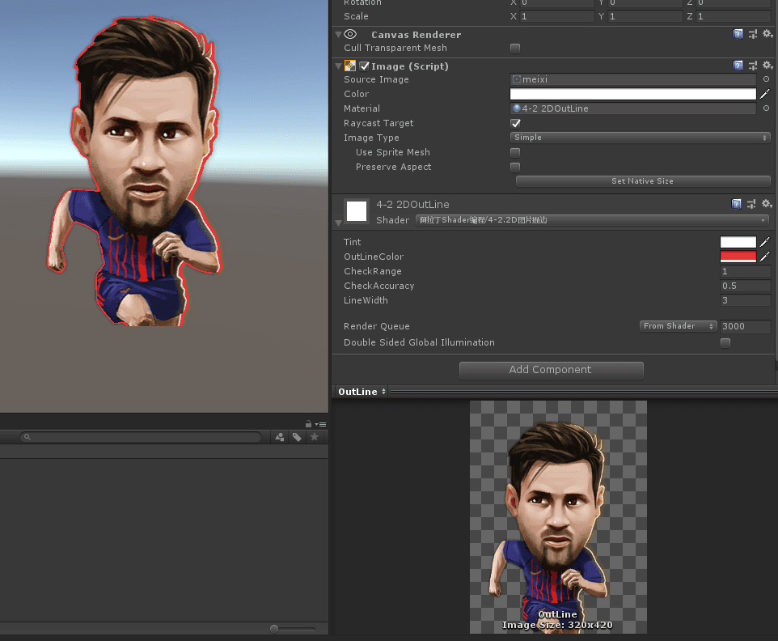

##### 圆角头像

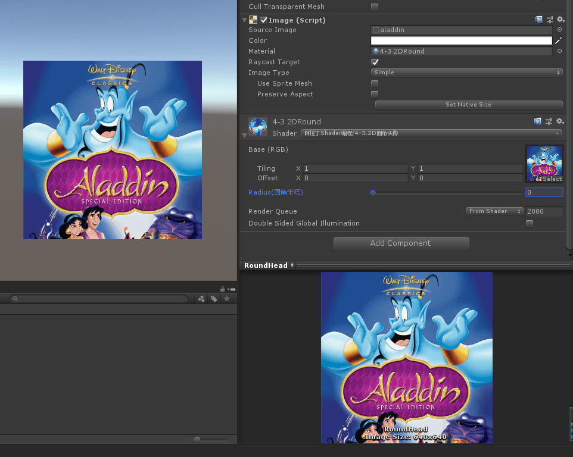

#### 不断添加中。。。

## 参考资料:

###1.[毛新云(浅墨)](http://blog.csdn.net/zhmxy555/article/category/2681301)

###2.[冯乐乐(妈妈说女孩子要自立坚强)](http://blog.csdn.net/candycat1992/article/category/1782159)

###3.[lupeng的博客](http://blog.csdn.net/u011047171)

###4.[自己的博客](https://aladdin.blog.csdn.net/article/category/6670402)
